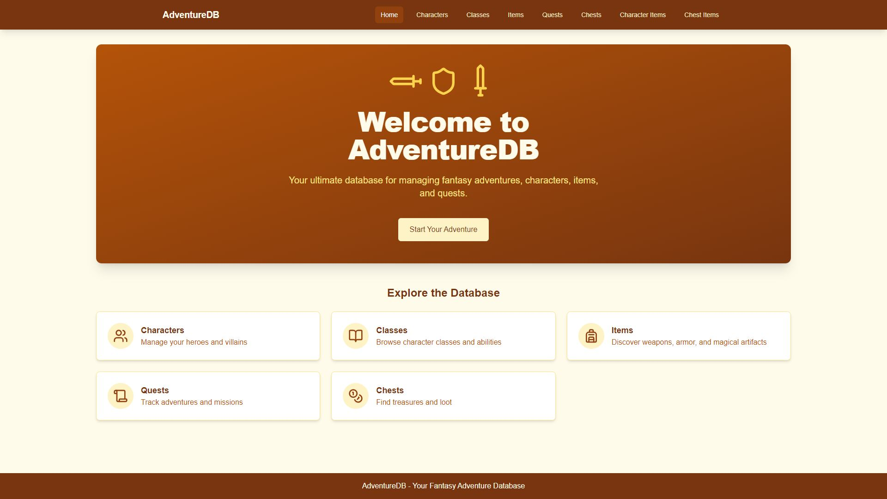

# AdventureDB

**This is an administrative system for managing data associated with an RPG adventure game.**



## 📂 Project Structure

```bash
AdventureDB/
├── backend/        # Backend service (Node.js, etc.)
│   └── README.md   # Backend-specific documentation
├── frontend/       # Frontend application (React, TypeScript, Vite, etc.)
│   └── README.md   # Frontend-specific documentation
├── proof.JPG       # Image file for documentation
├── README.md       # Main project documentation
└── sql/            # Refernce SQL files
    ├── DDL.sql
    └── DML.sql
```

## 🚀 Getting Started

### 1️⃣ Clone the Repository

```bash
git clone https://github.com/purelyKai/AdventureDB.git
cd AdventureDB
```

### 2️⃣ Setup Instructions

**Backend**

```bash
cd backend
npm run start:prod
```

**Frontend**

```bash
cd frontend
npm run start:prod
```

## 🛠️ Tech Stack

- **Backend**

  - Node.js
  - Express
  - Forever

- **Frontend**

  - React
  - TypeScript
  - Vite
  - TailwindCSS

- **Database**

  - MariaDB (MySQL)
